# Senin, 31 Oktober 2022

## **Prop Types**

Prop Type digunakan untuk melakukan _type checking_ (mengecek tipe data sebuah props) pada Javascript.

Type checking dilakukan untuk mencegah adanya perbedaan tipe data pada saat Parent melemparkan _props_ ke Childnya (component-nya). Nantinya akan muncul pesan error yang akan memberitahukan adanya error dan di baris mana.

contoh: Pada parent tipe data propsnya adalah String, namun saat dilempar propsnya ke Child, tipe data props yang diterima adalah number.

contoh kasus: Terdapat file **App.jsx** sebagai parent, dan file **StudentInfo.jsx** sebagai childnya.

**StudentInfo.jsx**


**App.jsx**


Maka hasilnya pada browser adalah :

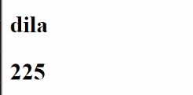

### Cara menggunakan prop-types

1. Install pada folder projek react

```
npm install prop-types
```

2. Import pada Child (component)

```javascript
import PropTypes from "prop-types";
```


3. Tambahkan method propTypes pada function component.


Setelah ada pesan eror, kita jadi mengetahui alasan eror dan dapat membenarkan letak kesalahannya.

### Tipe data "_any_"

Tipe data ini dapat menampung tipe data apa saja.

```javascript
props: PropTypes.any;
```

### .isRequired

.isRequired digunakan utk memberi tahu bahwa harus ada props yang didefinisikan prop-types.

contoh: kita menambahkan prop-types untuk props dengan nama _info_ pada Child, namun ternyata pada Parent tidak ada props yang bernama _info_. Maka ketika kita menggunakan .isRequired akan dimunculkan pesan eror.

```javascript
props: PropTypes.any.isRequired;
```

### .oneOfType

.oneOfType memberikan pilihan kepada props untuk menerima lebih dari satu tipe data.

```javascript
props: PropTypes.any.oneOfType([PropTypes.string, PropTypes.number]);
```

pesan eror yang ditampilkan apabila tipe data yg diinput bukan string atau number


### PropTypes untuk tipe data Array

```javascript
props: PropTypes.array;
```

### Mengecek tipe data unsur sebuah Array menggunakan .arrayOf

1. Memberikan satu tipe data pada unsur array

```javascript
props: PropTypes.arrayOf(PropTypes.number);
```

Pada contoh di atas prop-types diminta untuk mengecek apakah tipe data unsur yang ada di dalam array adalah _number_.

2. Memberikan .oneOfType pada unsur array

```javascript
props: PropTypes.arrayOf(PropTypes.oneOfType([PropTypes.string, PropTypes.number]));
```

### Prop-types untuk Tipe data Object


**info** memiliki tipe data object.

```javascript
info: PropTypes.object;
```

### Mengecek tipe data properti sebuah Object

```javascript
props: PropTypes.shape({
  properti1: PropTypes.string,
  properti1: PropTypes.number,
});
```

### Mengecek nilai dan key dari sebuah Object dengan menggunakan _.exact_

Apabila menggunakan .exact maka prop-types tidak hanya akan memeriksa tipe data dari properti object, namun juga jumlah keynya. Prop types akan memeriksa apakah key yang terdapat pada Parent sudah sesuai dengan key yang dicek pada Child.

contoh: Pada Parent terdapat object dengan 3 properti (key), namun pada saat melakukan type checking pada Child properti (key) yang didefinisikan hanya 2. Dengan menggunakan _.exact_ akan mengecek hal ini. Apabila tidak sesuai maka akan memunculkan pesan eror.

```javascript
props: PropTypes.exact({
  properti1: PropTypes.string,
  properti1: PropTypes.number,
});
```

### Menggabungkan .isRequired pada prop-types object

```javascript
props: PropTypes.exact({
  properti1: PropTypes.string,
  properti1: PropTypes.number,
}).isRequired,
```

# Selasa, 1 November 2022

## Router

Pada SPA, kita tetap bisa berpindah-pindah halaman dengan menggunakan **router**.


React Router yg akan digunakan adalah v6, disarankan untuk pemula.

### Proses Instalasi

Pada folder react yang dituju, ketik pada command prompt

```
npm install react-router-dom@6
```

### Proses pemasangan

1. Pada main.jsx atau index.jsx import BrowserRouter

```
import { Browser Router } from react-router-dom
```

2. Pada main.jsx atau index.jsx bungkus <_App_/> dengan <_BrowserRouter_>


3. Pada **App.jsx**, import _Routes, Route_, dan _Link_

```
import {Routes, Route, Link} from 'react-router-dom'
```

Kemudian pada bagian return berikan pembungkus <_Routes_>


4. Membuat folder 'pages' di dalam folder 'src' untuk menampung file halaman


5. Buat HomePage.jsx dan AboutPage.jsx di dalam folder _page_


HomePage.jsx


6. Di dalam tag <_Routes_> panggil single tag <_Route_>


**path** adalah penulisan yang akan muncul pada link ketika halaman yang dipanggil dimuat. Contohnya pada gambar ini, dapat disimpulkan **path**nya adalah **"/bundles"**

<br>


Tambahkan juga **element={}** untuk memanggil page yang mau kita tuju. Di sini kita menjadikan HomePage.jsx sebagai halaman yang pertama kali dirender. Oleh karena itu kita dapat mengisi **path="/"**

Cara pemanggilan page **HomePage.jsx** sama seperti ketika kita memanggil component.


### Pemasangan Navbar

Jika kita memiliki 4 page, dan kita ingin semua page tersebut memiliki navbar, maka kita dapat memasang navbar pada **App.jsx** tempat di mana kita akan memanggil 4 page tadi. Jadi tidak perlu memasangkan navbar satu-persatu untuk setiap 4 page tadi.

Jika pada HTML biasa kita menggunakan tag <_a_>, pada penggunaan router kita akan gunakan <_Link_> dilengkapi dengan attribute **to**


### Params

Params digunakan untuk mengirim data. Format penulisannya adalah "/:params"

Contohnya di sini akan dibuat page DetailPage.jsx


Lalu pada **App.jsx** dipanggil halaman DetailPage. Kemudian di bagian **path**nya diberikan params berupa **id**


<br>

### useNavigate untuk **berpindah halaman** sekaligus melakukan **pengiriman data**

Kelebihan: lebih mudah digunakan jika kita melakukan pengiriman data. Contohnya untuk halaman detail, (contoh pada Tokopedia) setiap barang jika diklik akan memiliki detailnya sendiri yang akan menampilkan deskripsi lengkap barang, review pembeli, button untuk menambah ke keranjang, dll. Untuk setiap detail.

```javascript
import { useNavigate } from "react-router-dom";
```

### useParams()

```javascript
import { useParams } from "react-router-dom";
```

# Rabu, 2 November 2022

## Menyamakan Data Profile


Data pada component Profile dan component Navbar sama, yaitu sama-sama menampilkan foto profil dari user dan menampilkan nama lengkap user. Bagaimana cara membuat data pada kedua component ini sama?

Caranya adalah dengan meletakkan data pada **App.jsx**. Sehingga nantinya data dari **App.jsx** akan diberikan kepada component Navbar dan Profile. Untuk analoginya, perhatikan gambar di bawah.


<br>

Component Nav dan component Profile terbagi menjadi component-component yang lebih kecil lagi.

Pada component Navbar, dapat dipecah menjadi component-component yang lebih kecil lagi, yaitu component menu dan component user profile button.

Sedangkan pada component halaman Profile dapat dipecah lagi menjadi component card profile user, user skillBadge, dan user skillPath.

<br>

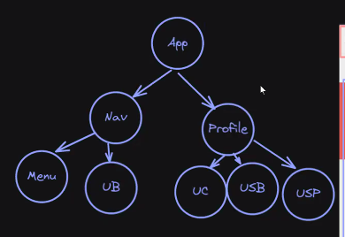

### Proses pemberian data (Props Dealing)

Props akan dilemparkan dari App ke Nav kemudian ke user profile button. Begitu juga dari Nav dilemparkan ke Profile baru kemudian ke user card.


Hal ini dimakan **Props dealing** (props akan dioper dari satu component ke component lainnya).

Permasalahan yang mungkin timbul dari props dealing adalah

Mengatasinya bisa dengan menggunakan **state management**.


## Redux

Dari beberapa state management yang ada, kita akan mempelajari salah satunya yaitu **redux**.

Sekarang kita akan membuat code untuk kasus seperti ini:

Ketika kita menambahkan sebuah product ke keranjang, maka notifikasi angka pada logo keranjang di navbar akan bertambah.

### **Membuat component Counter, Keranjang, ListProduct, SummaryPembelian**

<br>

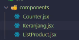

### Menampilkan list product

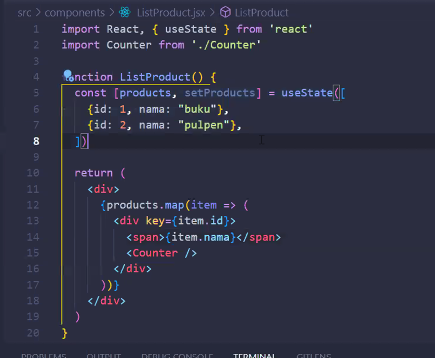

**App.jsx**

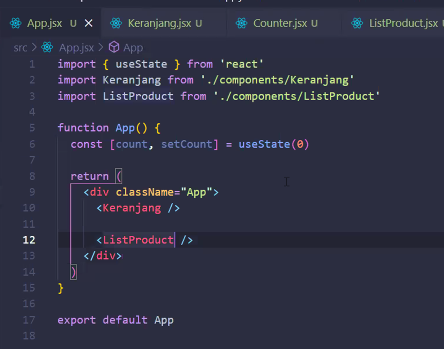

Ketika dijalankan pada browser:


## **Pemasangan redux**

Tahapannya:

1. Install redux
2. Buat store
3. Buat reducer
4. Membuat provider
5. Ambil data dari store

- Instalasi redux pada folder projek react yang dituju

  ```
  npm install redux react-redux
  ```

Setelah itu kita perlu membuat **store**. Store adalah wadah untuk menampung code props yang akan dibagi-bagi datanya untuk banyak component. Di dalam store bisa terdapat beberapa reducer.

Analoginya:

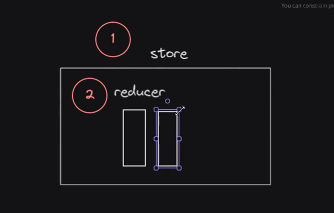

- Membuat folder baru bernama **redux**, kemudian buat folder **store** di dalamnya, lalu buat file **index.js** di dalamnya

  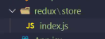

- Membuat folder **reducer** di dalam folder **redux**, kemudian membuat file **keranjangReducer.js**

  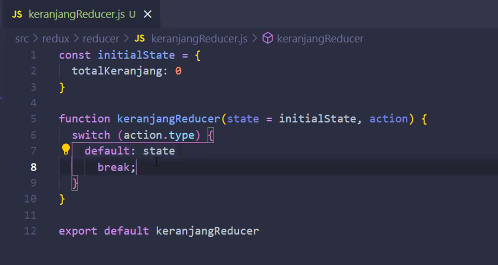

- Membuat provider

  Provider seperti memberi jangkauan kepada component apa saja store dapat diakses.

  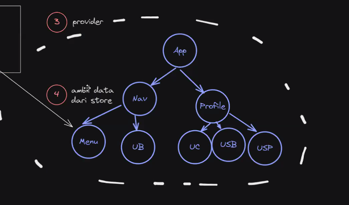

  Karena **App** adalah component utama yang merupakan jalan masuk untuk seluruh component yang akan dibuat (atau dapat dikatakan App sebagai parent), maka kita hanya perlu membungkus App dengan provider. Component **App** dipanggil pada **main.jsx**, maka kita perlu memasangkan provider pada **main.jsx**.

  **main.jsx**

  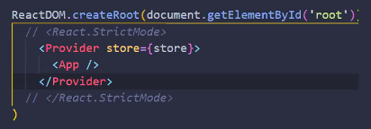

  <br>

- Mengambil data dari store dengan menggunakan **useSelector**

  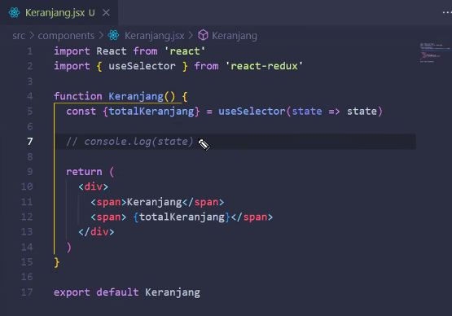

  useSelector akan mengambil data state dari store. Store akan menyediakan reducer yang bernama KeranjangReducer. Sehingga component Keranjang.jsx akan mengambil data dari KeranjangReducer.

## Action

- Membuat folder action pada folder redux

  

- keranjangAction.js

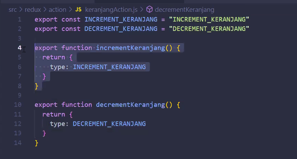

- pada keranjangReducer.js, diimport objek INCREMENT_KERANJANG dan DECREMENT_KERANJANG


- pada component Counter, gunakan **useDispatch**

Dispatch gunanya adalah **mengirim action ke dalam reducer**.

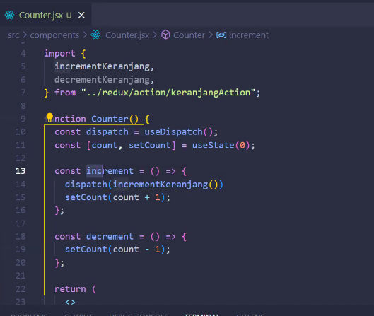
