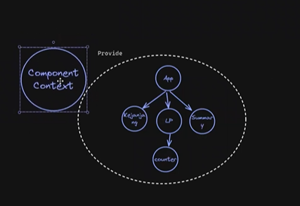
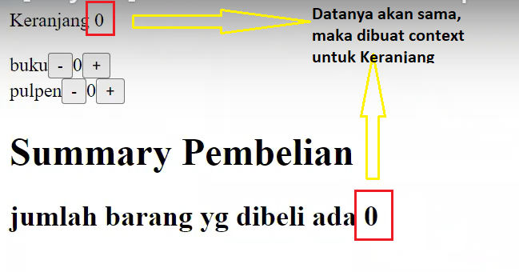
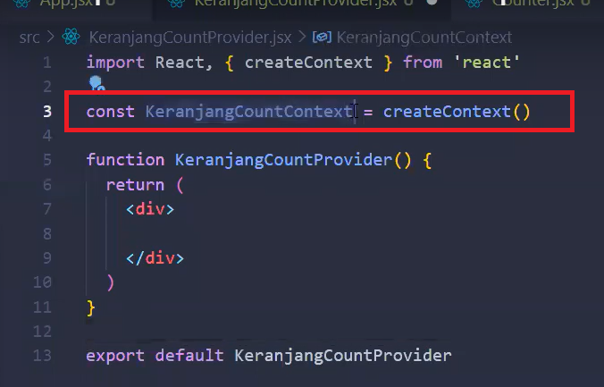
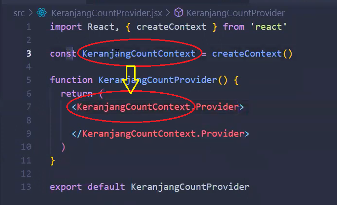
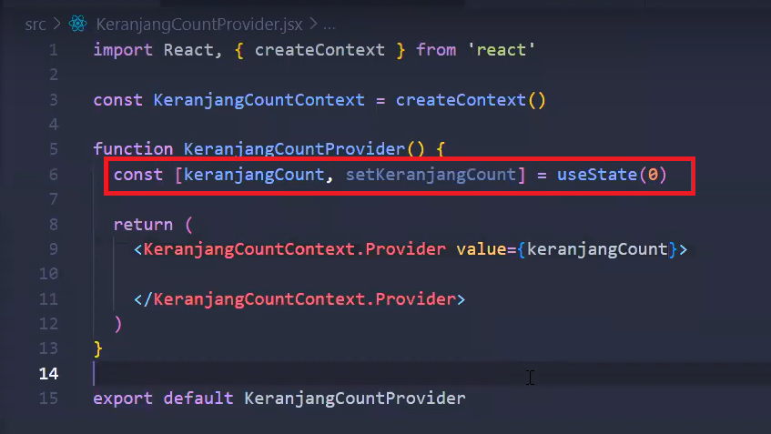
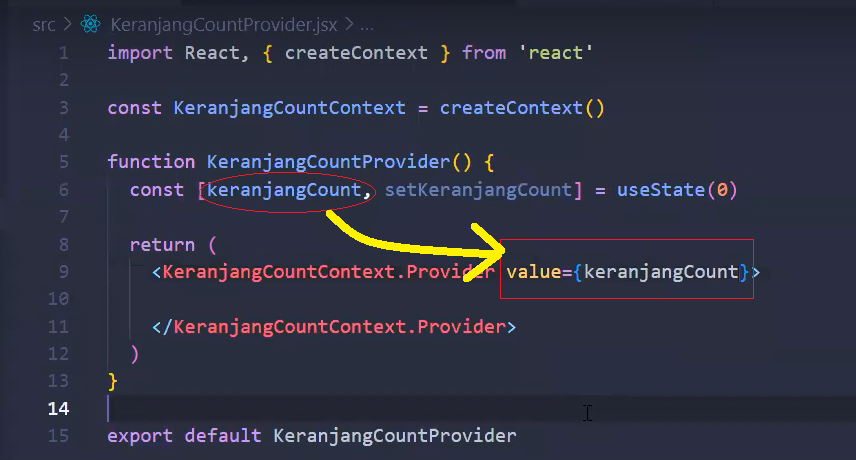
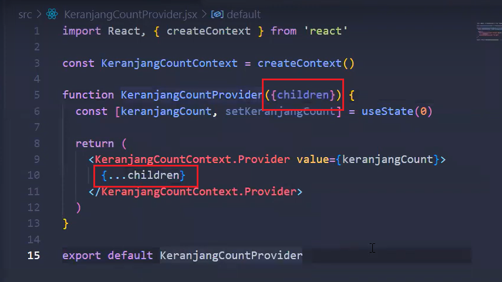
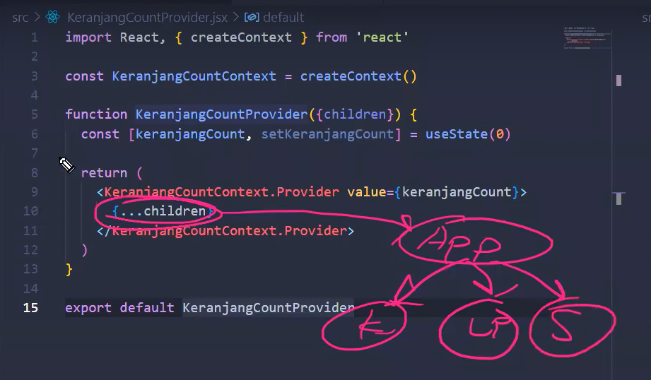
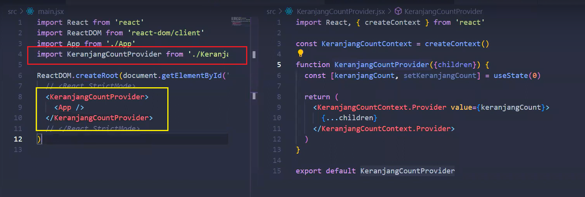
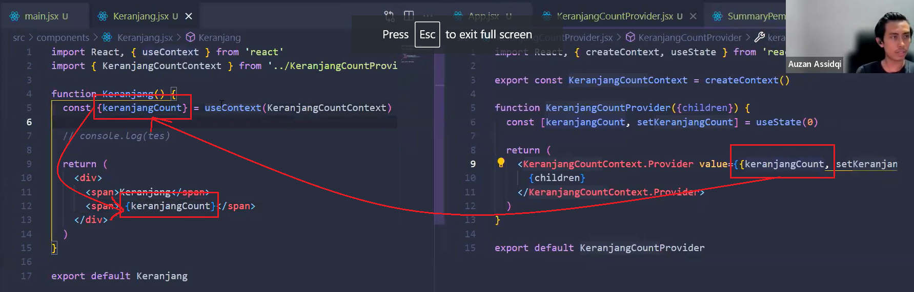

# Senin, 07 November 2022

## Context : an alternative to passing props

Context membuat parent component dapat membagikan data di dalamnya kepada seluruh children component di bawahnya.

Penggunaan context dapat menghindari **props drilling** karena **context menyediakan cara untuk mengoper data ke seluruh tree component tanpa harus mengoper props ke bawah satu persatu secara manual**.

ide sederhana dari context:
kita akan membuat sebuah **component context** (file component yang berisi context), kemudian component context tersebut akan memprovide props utk seluruh components lainnya.



Untuk contohnya, perhatikan gambar di bawah.



Maka dari itu, akan dibuat sebuah component context bernama **KeranjangCountProvider.jsx**.

### **proses membuat context**

1. Membuat file context
   

2. Mengimport createContext

   ```javascript
   import { createContext } from "react";
   ```

3. Membuat context dengan createContext()
   

4. Membuat provider
   Membuat provider dengan memanggil nama context dan menambahkan .Provider pada returnnya.

    

5. Membuat state utk angka 0 pada keranjang
   

6. Memberikan value ke dalam tag Provider agar seluruh component yang dibungkus di dalam tag Provider dapat menggunakan state
   

7. Memberikan {children} sebagai parameter dari function

   Karena kita mau stater **keranjangCount** diberikan pada seluruh component, maka kita dapat memberikan parameter pada function KeranjangCountProvider dan memberikan {...children} di dalam bungkusan tag <KeranjangCountContext.Provider>

   

   <br>

   {...children} akan berisi App, di mana App akan berisi seluruh component yang ada.

   

8. Panggil component context di dalam main.jsx / index.js
   

---

### Menggunakan props yang sudah disediakan pada component context menggunakan useContext


